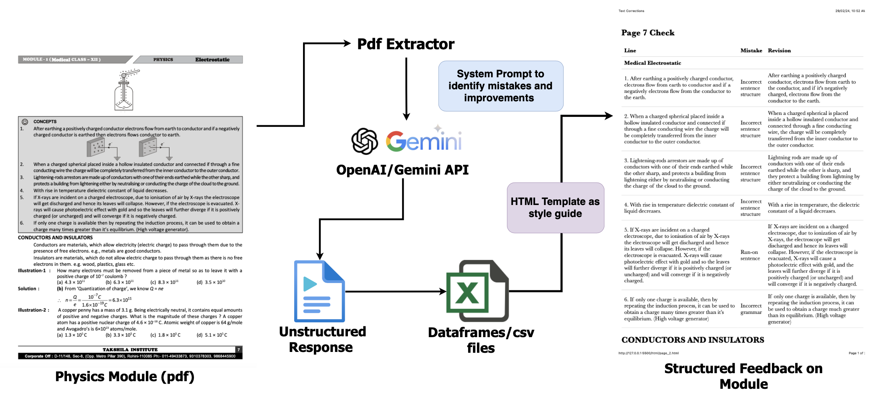

# PDF Physics Module Quality Assessment Tool

This repository contains the code for a program designed to check and validate physics modules for Takshila Physics Institute. The workflow uses OpenAI's API to process PDFs, extract information, and provide structured feedback on the educational content.

## Architecture

The architecture diagram above illustrates the workflow from the physics module PDFs through various processing steps to generate structured feedback.

1. **Extraction from PDFs**: PDFs containing physics module data are parsed to extract text and other relevant information.

2. **Quality Check and Improvement with LLM API**: The extracted text undergoes a quality check and analysis using the LLM (Language Model) API, which identifies mistakes and suggests improvements.

3. **Data Wrangling of Unstructured Responses into Dataframes**: The output from the LLM API, along with other extracted data, is processed and structured into dataframes. This step involves organizing unstructured responses into a structured format suitable for further processing.

4. **Integration with HTML Template and Compilation into PDF**: The structured dataframes are imported into an HTML template using JSON format. Each page of the extracted PDF undergoes this process individually. The HTML template is then compiled into a PDF document, incorporating the structured feedback data.

This workflow ensures that each page of the physics module PDFs is processed through the above steps to generate structured feedback while maintaining enough latency to not get rate-limited from OpenAI/Gemini.

## Repository Structure

- `app.py` - The main application script that orchestrates the PDF checking process.
- `images/`
  - `architecture.png` - The architecture diagram of the program and workflow.
- `openai/`
  - `count_tokens.py` - Utility script for counting tokens in the processed text.
  - `csv_pdf.py` - Script that handles the conversion of PDF content into CSV files.
  - `html_pdf.py` - Converts PDF content into HTML format, using the template as a style guide.
  - `pdf_to_html.py` - Extracts data from PDFs and transforms it into an HTML structure.
  - `trail.py` - A trial script for testing and debugging purposes.

## Workflow

1. **PDF Extraction**: The `pdf_to_html.py` script extracts content from PDFs and converts it to HTML format.
2. **OpenAI/Gemini API**: The API is utilized to process the HTML content and generate an unstructured response.
3. **openAI/pdf_to_html.py**: The `csv_pdf.py` script organizes the response into CSV files or data frames for easier analysis and processing.
4. **System Prompt**: Scripts like `trail.py` may be used to identify mistakes and improvements within the content.
5. **HTML Template**: The `html_pdf.py` script applies a predefined HTML template to style the output.

## Installation and Usage

To use this program, follow these steps:

1. Clone the repository to your local machine.
2. Install the required dependencies as listed in the `requirements.txt` file (not included in the repository structure above, please add if available).
3. Execute `app.py` to start the PDF checking process.

Ensure that you have the necessary credentials and API keys for accessing OpenAI's services.

## License

This project is licensed under the [LICENSE](LICENSE.md) file in the root directory of this source tree.

For further questions or support, please contact gaurisinghh3@gmail.com
